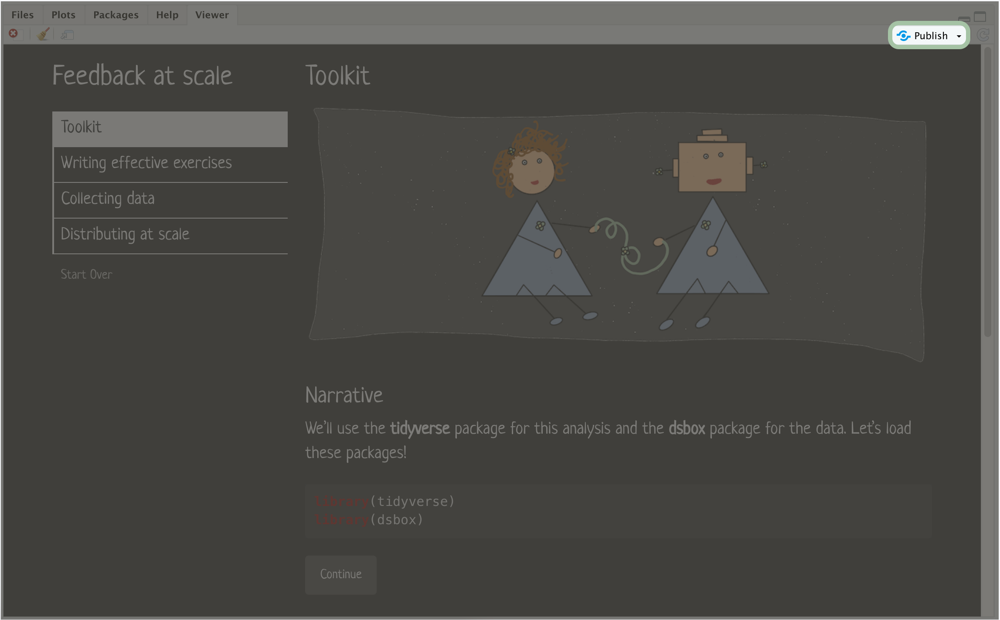
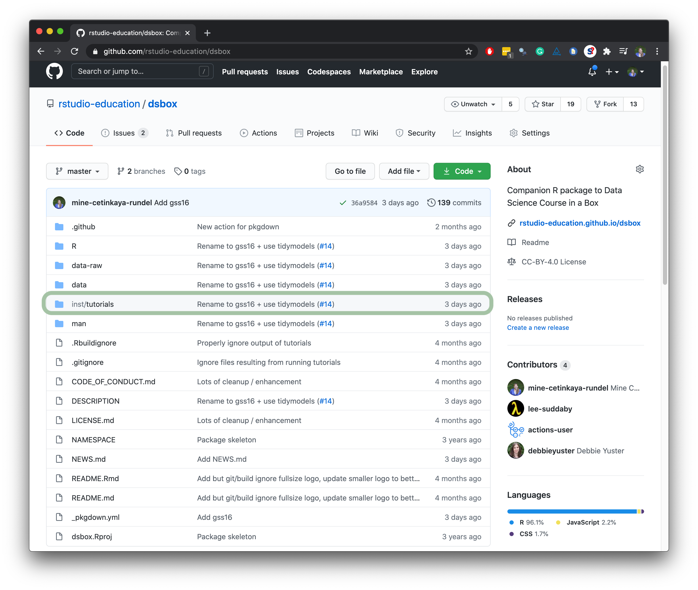
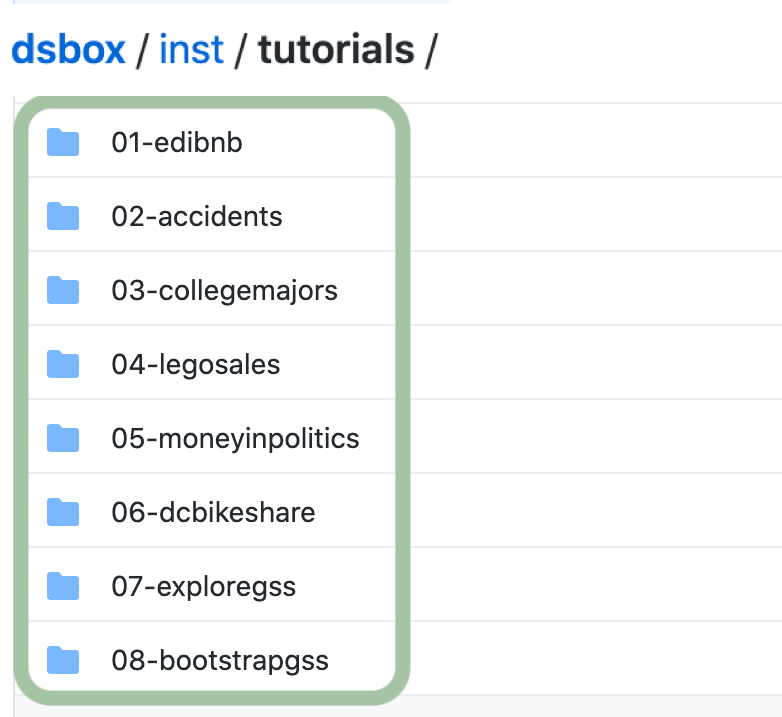
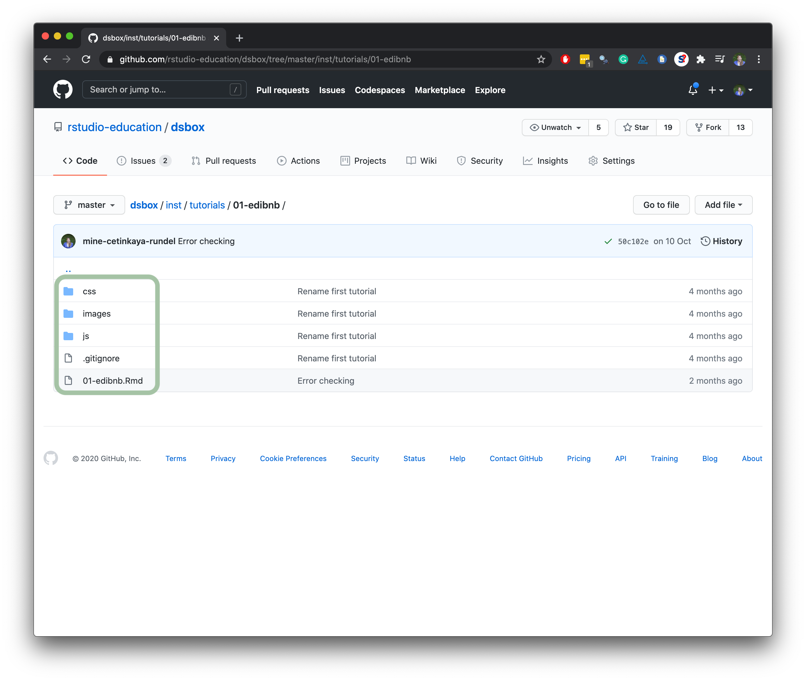

<!-- Add JavaScript code for making the exercise code larger -->
<script language="JavaScript" src="js/exercise-font-size.js"></script>

```{r setup, include=FALSE}
# load packages
library(learnr)     # rstudio/learnr@bdb2c52
library(gradethis)  # rstudio-education/gradethis@b2d9ef5
library(learnrhash) # rundel/learnrhash@714511c
library(dsbox)      # rstudio-education/dsbox@827bd71
library(thematic)   # rstudio/thematic@0a6b4b7
library(tidyverse)
library(showtext)

# dark theme and larger font size for plots
thematic_on(
  bg = "#212121",
  fg = "#ffffff",
  accent = "#354b63",
  font = font_spec(scale = 1.5, families = "Neucha")
)

# set options for exercises and checking
gradethis_setup()

# make fonts work
# https://stackoverflow.com/a/55159245/5157940
dir.create("~/.fonts")
file.copy("www/neucha.ttf", "~/.fonts")
system("fc-cache -f ~/.fonts")

# hide non-exercise code chunks
knitr::opts_chunk$set(echo = FALSE)
```
  
## learnr + gradethis

```{r header, out.width = "100%"}
knitr::include_graphics("images/header.png")
```

### Narrative

We'll use the **tidyverse** package for this analysis and the **dsbox** package for the data. Let's load these packages!

```{r load-packages, echo = TRUE}
library(tidyverse)
library(dsbox)
```

### Ready-to-run code

The dataset we'll be using is called **edibnb** and it contains information on Airbnb listings in Edinburgh. You can view the names of the variables using the `names()` function.

```{r edibnb-names, exercise=TRUE}
names(edibnb)
```

### Coding exercises

How many Airbnb listings are included in this dataset? Use the following code block to find out.

```{r edibnb-nrow, exercise=TRUE}
___(edibnb)
```

<div id="edibnb-nrow-hint">
**Hint:** Which function do we use to obtain the **n**umber of **row**s in a data frame?
</div>

```{r edibnb-nrow-check}
grade_this({
  pass_if_equal(13245L, message = "There are 13,245 observations, i.e. 13,245 Airbnb listings, in the dataset.")
  fail_if_equal(10L, message = "Each observation is represented in one row. Did you calculate the number of columns instead of rows?")
  fail(message = "Not quite. Each observation is represented in one row. Can you remember which function we use to calculate the number of rows?")
})
```

```{r q1}
question("What does each row in the `edibnb` dataset represent?",
    answer("The values of a certain variable"),
    answer("An individual Airbnb listing",
           correct = TRUE,
           message = "Each row in the dataset contains one observation of each field, each relating to a single Airbnb listing."),
    answer("An Airbnb booking"),
    answer("An Edinburgh neighbourhood")
  )
```

## Behind the scenes

<br>

<a href="https://rstudio.cloud/project/2005617">

</a>

<a href="https://github.com/mine-cetinkaya-rundel/feedback-at-scale">

</a>


<br>


## Writing effective exercises

The three most expensive neighbourhoods, in terms of mean nightly price, are New Town, Old Town, and West End. Calculate the median number of reviews in these neighbourhoods and arrange them in descending order.

### Option 1. No scaffolding

Using `gradethis::grade_this_code()`:

```{r median-rating-option-1, exercise = TRUE}

```

```{r median-rating-option-1-solution}
edibnb %>%
  filter(neighbourhood %in% c("New Town", "Old Town", "West End")) %>%
  group_by(neighbourhood) %>%
  summarise(median_rating = median(number_of_reviews)) %>%
  arrange(desc(median_rating))
```

```{r median-rating-option-1-check}
grade_this_code()
```

### Option 2. Scaffolding and Strict check

Using `gradethis::grade_this_code()`:

```{r median-rating-option-2, exercise = TRUE}
edibnb %>%
  filter(neighbourhood ___ c("New Town", "Old Town", "West End")) %>%
  group_by(___) %>%
  summarise(___) %>%
  ___
```

```{r median-rating-option-2-hint-1}
edibnb %>%
  filter(neighbourhood %in% c("New Town", "Old Town", "West End")) %>%
  group_by(___) %>%
  summarise(___) %>%
  ___
```

```{r median-rating-option-2-hint-2}
edibnb %>%
  filter(neighbourhood %in% c("New Town", "Old Town", "West End")) %>%
  group_by(neighbourhood) %>%
  summarise(___) %>%
  ___
```

```{r median-rating-option-2-hint-3}
edibnb %>%
  filter(neighbourhood %in% c("New Town", "Old Town", "West End")) %>%
  group_by(neighbourhood) %>%
  summarise(median_rating = ___(number_of_reviews)) %>%
  ___
```

```{r median-rating-option-2-hint-4}
edibnb %>%
  filter(neighbourhood %in% c("New Town", "Old Town", "West End")) %>%
  group_by(neighbourhood) %>%
  summarise(median_rating = ___(number_of_reviews)) %>%
  arrange(___)
```

```{r median-rating-option-2-solution}
edibnb %>%
  filter(neighbourhood %in% c("New Town", "Old Town", "West End")) %>%
  group_by(neighbourhood) %>%
  summarise(median_rating = median(number_of_reviews)) %>%
  arrange(desc(median_rating))
```

```{r median-rating-option-2-check}
grade_this_code()
```

###

**Under the hood**

```{r ref.label = "median-rating-option-2-check", eval = FALSE, echo = TRUE}
```


### Option 3. Scaffolding and flexibility

Using `gradethis::grade_this()`:

```{r median-rating-option-3, exercise = TRUE}
edibnb %>%
  ___ 
```

```{r median-rating-option-3-hint-1}
edibnb %>%
  filter(___) %>%
  ___
```

```{r median-rating-option-3-hint-2}
edibnb %>%
  filter(neighbourhood %in% c("New Town", "Old Town", "West End")) %>%
  ___ 
```

```{r median-rating-option-3-hint-3}
edibnb %>%
  filter(neighbourhood %in% c("New Town", "Old Town", "West End")) %>%
  group_by(neighbourhood) %>%
  ___
```

```{r median-rating-option-3-hint-4}
edibnb %>%
  filter(neighbourhood %in% c("New Town", "Old Town", "West End")) %>%
  group_by(neighbourhood) %>%
  summarise(median_rating = median(number_of_reviews)) %>%
  ___
```

```{r median-rating-option-3-hint-5}
edibnb %>%
  filter(neighbourhood %in% c("New Town", "Old Town", "West End")) %>%
  group_by(neighbourhood) %>%
  summarise(median_rating = median(number_of_reviews)) %>%
  arrange(___)
```

```{r median-rating-option-3-check}
grade_this({
  pass_if_equal(
    tibble(
      neighbourhood = c("Old Town", "New Town", "West End"), 
      median_rating = c(31, 23, 15)
      ), 
    message = "You've succesfully calculated the median number of ratings and arranged them in descending order."
    )
  fail_if_equal(
    tibble(
      neighbourhood = c("West End", "New Town", "Old Town"), 
      median_rating = c(15, 23, 31)
      ), 
    message = "You've succesfully calculated the median number of ratings, but did you forget to arrange them in ascending order?")
  fail_if_equal(
    tibble(
      neighbourhood = c("New Town", "Old Town", "West End"), 
      median_rating = c(23, 31, 15)
      ), 
    message = "You've succesfully calculated the median number of ratings, but did you forget to arrange them?"
    )
  fail(message = "Not quite. Take a peek at the hints!")
})
```

### 

**Under the hood**

```{r ref.label = "median-rating-option-3-check", eval = FALSE, echo = TRUE}
```


## Collecting data: learnrhash

Create a histogram of the distribution of Airbnb listing prices (nightly rates) in Edinburgh and answer the following questions based on the histogram.

```{r price-histogram, exercise = TRUE, fig.showtext = TRUE}
ggplot(___, aes(x = ___)) +
  ___() +
  labs(
    ___ = "Airbnb listing price, in £",
    ___ = "Frequency",
    ___ = "Distribution of Airbnb nightly rates in Edinburgh"
  )
```

```{r price-histogram-hint-1}
ggplot(edibnb, aes(x = ___)) +
  ___() +
  labs(
    ___ = "Airbnb listing price, in £",
    ___ = "Frequency",
    ___ = "Distribution of Airbnb nightly rates in Edinburgh"
  )
```

```{r price-histogram-hint-2}
ggplot(edibnb, aes(x = price)) +
  ___() +
  labs(
    ___ = "Airbnb listing price, in £",
    ___ = "Frequency",
    ___ = "Distribution of Airbnb nightly rates in Edinburgh"
  )
```

```{r price-histogram-hint-3}
ggplot(edibnb, aes(x = price)) +
  geom_histogram() +
  labs(
    ___ = "Airbnb listing price, in £",
    ___ = "Frequency",
    ___ = "Distribution of Airbnb nightly rates in Edinburgh"
  )
```

```{r price-histogram-solution}
ggplot(edibnb, aes(x = price)) +
  geom_histogram() +
  labs(
    x = "Airbnb listing price, in £",
    y = "Frequency",
    title = "Distribution of Airbnb nightly rates in Edinburgh"
  )
```

```{r price-histogram-check}
grade_this_code(
  correct = "And note that there are a couple warnings, we'll get to those in a bit."
)
```

```{r q2}
question(
  "Which of the following describes the shape of the distribution of nightly rates of Airbnb edibnb in Edinburgh? Check all that apply.",
  answer("Right skewed",
    correct = TRUE
  ),
  answer("Left skewed",
    message = "Skew is on the side of the longer tail"
  ),
  answer("Symmetric",
    message = "If you were to draw a vertical line down the middle of the x-axis, would the left and right sides of the distribution look like mirror images?"
  ),
  answer("Unimodal",
    correct = TRUE
  ),
  answer("Bimodal",
    message = "How many prominent peaks do you see?"
  ),
  answer("Multimodal",
    message = "How many prominent peaks do you see?"
  )
)
```

```{r q3}
question(
  "Which of the following is false?",
  answer("There are no listings with a nightly rate above £1,250."),
  answer("More than 50% of listings have a nightly rate below £250."),
  answer("More than 25% of listings have a nightly rate above £500.",
    correct = TRUE
  ),
  answer("It is possible that some of the listings have a nightly rate of £0.")
)
```

### Submit answers

```{r context="server"}
learnrhash::encoder_logic(strip_output = TRUE)
```

```{r encode, echo=FALSE}
learnrhash::encoder_ui(
  ui_before = div(strong("Once you're done with your quiz, click on Generate Submission below and copy the hash generated and paste it in the form below."), br(), br()),
  ui_after  = learnrhash::iframe_ui(
    src = "https://docs.google.com/forms/d/e/1FAIpQLSc4uGpGDICBFRgenxU0FYi0KOJku9f06POZ5OP2RHruBn3Iig/viewform?embedded=true",
    width="700px", height= "1000px"
  )
)
```

### Decode hash

The following would not be included in a student facing tutorial, but has been included here to demonstrate the decoding functionality of the [**learnrhash**](https://github.com/rundel/learnrhash) package. 

```{r context="server"}
learnrhash::decoder_logic()
```

```{r decode, echo=FALSE}
learnrhash::decoder_ui()
```

### View data

You can view the collected data [here](https://docs.google.com/spreadsheets/d/1xwkw2TQW71lVa0REVvYep-8ODXEoS_kI1Uz024F45Yg/edit#gid=1064275118).

<iframe width="900" height="400" src="https://docs.google.com/spreadsheets/d/e/2PACX-1vSFC6ZHGCAXCTAXfvy6Q36a1_AblmzScC8HYqZ0T2eSZeCqMCso75DiQQ_JtTWtbxYxc5sWL4QPyAEr/pubhtml?gid=1064275118&amp;single=true&amp;widget=true&amp;headers=false"></iframe>

### Process data

```{r echo=FALSE}
tutorial_marks <- read_rds("www/tutorial-marks.rds")
```

**Student scores**

```{r}
tutorial_marks$student_scores
```

**Feedback summary**

```{r}
tutorial_marks$feedback_summary
```

## Distributing at scale

### On shinyapps.io

```{r publish-1, out.width = "90%"}

```

### In a package

The [**dsbox**](https://rstudio-education.github.io/dsbox/) package contains learnr tutorials (and datasets) accompanying the [Data Science Course in a Box](https://datasciencebox.org/) curriculum.

```{r dsbox-1, out.width = "80%"}

```

###

```{r dsbox-2, out.width = "50%"}

```

###

```{r dsbox-3, out.width = "50%"}

```

###

<iframe width="800" height="450" src="https://www.youtube.com/embed/mbpTYc2xBMY" frameborder="0" allow="accelerometer; autoplay; clipboard-write; encrypted-media; gyroscope; picture-in-picture" allowfullscreen></iframe>
